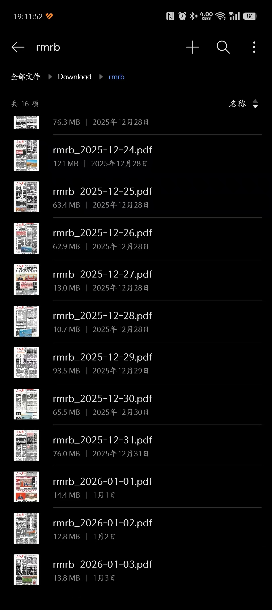
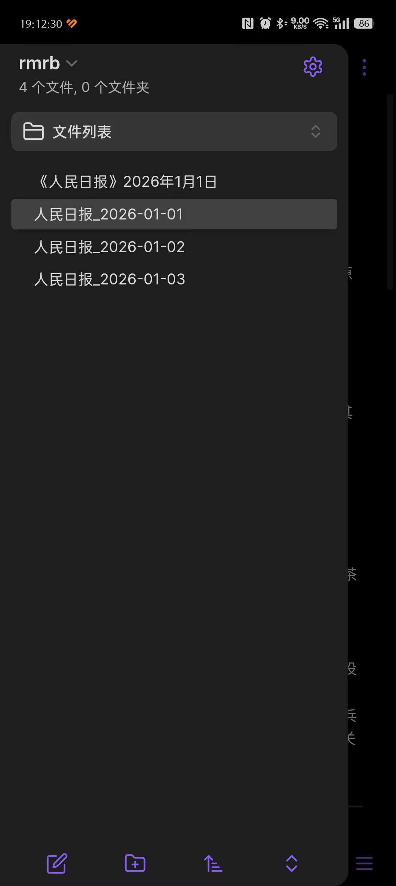
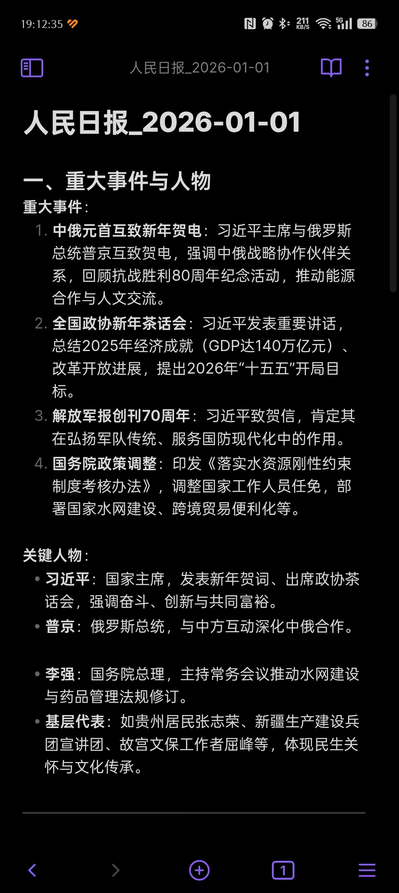

# 人民日报PDF完整处理工具集

这是一个用于人民日报PDF完整工作流程的Python工具集，支持从网站下载、文本提取到AI智能分析的全流程处理。

## 🎯 功能特性

### 📥 **PDF下载功能**
- 🌐 自动从人民日报官网下载指定日期的PDF版报纸
- 📄 自动检测报纸版面数量（通常8-16版）
- 🔄 智能合并多个版面为一个完整的PDF文件
- ⏰ 支持指定日期下载和批量下载

### 📖 **PDF文本提取**
- 🔍 使用PyPDF2库精确提取PDF文件中的文本内容
- 📝 处理各种PDF格式和编码
- 🛡️ 容错处理，防止提取失败影响整体流程

### 🤖 **AI智能分析**
- 🧠 基于大语言模型对人民日报内容进行深度分析
- 📊 自动分类识别：重大事件、评论文章、金句典故、优秀词组
- 📋 生成结构化的Markdown格式分析报告
- 💡 支持流式输出，实时显示分析过程

## 🎯 扩展用例
- 🧠 手机端定时爬取《人民日报》，如每天早晨7:00爬取当日《人民日报》
- 📊 自动分析当日报纸精华，并存入obsidian笔记






## 🏗️ 项目结构

```
xx/
├── rmrb_down.py              # 人民日报PDF下载工具
├── readpdf.py                # PDF文本提取工具  
├── note_for_rmrb.py          # 人民日报AI智能分析工具
├── requirements.txt          # 项目依赖列表
├── README.md                # 项目说明文档
└── storage/
    └── downloads/
        └── rmrb/            # 下载的PDF文件存储目录
            └── rmrb_YYYY-MM-DD.pdf
└── 人民日报_YYYY-MM-DD.md    # AI分析结果输出文件
```

## 📦 安装说明

### 1. 环境准备
```bash
# 确保Python版本 >= 3.7
python --version
```

### 2. 克隆项目
```bash
git clone <项目地址>
cd xx
```

### 3. 安装依赖
```bash
pip install -r requirements.txt
```

**依赖库列表**：
- `requests==2.31.0` - HTTP请求库，用于网页抓取
- `beautifulsoup4==4.12.2` - HTML解析库，用于网页内容解析
- `PyPDF2==3.0.1` - PDF处理库，用于文件读取和合并
- `openai==1.58.1` - OpenAI API库，用于大模型调用

## 🚀 使用方法

### 完整工作流程

#### 步骤1：下载人民日报PDF
```bash
# 下载当天的人民日报PDF
python rmrb_down.py

# 或下载指定日期的PDF
python -c "from rmrb_down import download_rmrb_pdf; download_rmrb_pdf('2025-12-31')"
```

#### 步骤2：AI智能分析
```bash
# 分析当天的人民日报
python note_for_rmrb.py

# 或分析指定日期的PDF
python -c "
from note_for_rmrb import main, date_str
date_str = '2025-12-31'
rmrb_pdf_file = f'rmrb_{date_str}.pdf'
content = read_pdf(rmrb_pdf_file)
markdown_note = extract_info(content)
with open(f'人民日报_{date_str}.md', 'w', encoding='utf-8') as file:
    print(markdown_note, file=file)
"
```

### 独立模块使用

#### 🔽 下载模块 (rmrb_down.py)
```python
from rmrb_down import download_rmrb_pdf

# 下载当天的人民日报
result = download_rmrb_pdf()
if result:
    print(f"PDF下载完成: {result}")
else:
    print("下载失败")

# 下载指定日期
result = download_rmrb_pdf('2025-12-31')
```

#### 📖 提取模块 (readpdf.py)
```python
from readpdf import read_pdf

# 提取PDF文本
text = read_pdf("rmrb_2025-12-31.pdf")
print(text[:500])  # 打印前500个字符
```

#### 🤖 分析模块 (note_for_rmrb.py)
```python
from note_for_rmrb import read_pdf, extract_info

# 读取PDF并分析
content = read_pdf("rmrb_2025-12-31.pdf")
analysis = extract_info(content)
print(analysis)
```

## 📊 输出格式

AI分析结果包含以下四个维度：

### 1. 🏛️ 重大事件
- **政治事件**: 重要会议、政策发布、人事变动
- **经济事件**: 经济数据发布、重大投资项目
- **社会事件**: 重要社会活动、民生政策
- **国际事件**: 外交活动、国际合作

### 2. 📰 评论员文章
- **政策解读**: 重要政策的深度分析
- **社论评论**: 官方立场和观点表达
- **理论文章**: 重要理论阐述和创新观点

### 3. 💎 金句、典故、古语
- **经典语句**: 领导人重要讲话中的精彩表达
- **古诗词引用**: 历史文献和古典文学的引用
- **典故运用**: 历史典故在现代语境中的运用

### 4. ✨ 优秀词组、新词
- **政策术语**: 创新性的政策表达和专业用语
- **新词热词**: 当下流行的政治和社会新词汇
- **表达技巧**: 优秀的修辞手法和表达方式

## ⚙️ 核心模块详解

### 📥 rmrb_down.py - PDF下载工具
- **主要功能**: 自动下载并合并人民日报PDF
- **核心函数**: 
  - `download_rmrb_pdf()` - 主入口函数
  - `get_pdf_urls()` - 获取所有版面PDF链接
  - `download_pdfs()` - 批量下载PDF文件
  - `merge_pdfs()` - 合并多个PDF文件
- **输出**: `storage/downloads/rmrb/rmrb_YYYY-MM-DD.pdf`

### 📖 readpdf.py - 文本提取工具
- **主要功能**: PDF文本内容提取
- **核心函数**: 
  - `read_pdf()` - 提取PDF文本内容
- **输入**: PDF文件路径
- **输出**: 纯文本字符串

### 🤖 note_for_rmrb.py - AI分析工具
- **主要功能**: 使用大模型进行智能分析
- **核心函数**: 
  - `extract_info()` - AI分析主函数
  - `read_pdf()` - PDF文本提取
- **AI模型**: ernie-4.5-turbo-vl (百度AI Studio)
- **输出**: `人民日报_YYYY-MM-DD.md`

## 🔧 配置说明

### API配置
在 `note_for_rmrb.py` 中配置AI服务：

```python
client = OpenAI(
    api_key="your-api-key",           # API密钥
    base_url="https://aistudio.baidu.com/llm/lmapi/v3",  # 百度AI Studio地址
)
```

### 模型参数
- **模型**: ernie-4.5-turbo-vl
- **最大输出**: 12000 tokens
- **温度**: 0.2 (确保输出稳定性)
- **思考模式**: 启用 (提高分析质量)
- **重复惩罚**: 1.0 (控制内容重复)

### 下载配置
- **请求超时**: 10-30秒
- **下载间隔**: 1秒 (避免请求过于频繁)
- **存储路径**: `storage/downloads/rmrb/`

## 📁 文件组织

### 输入文件
- **PDF文件**: `storage/downloads/rmrb/rmrb_YYYY-MM-DD.pdf`
- **手动上传**: 项目根目录下的 `rmrb_YYYY-MM-DD.pdf`

### 输出文件
- **分析报告**: `人民日报_YYYY-MM-DD.md`
- **提取文本**: 控制台输出或变量存储

## ⚠️ 使用注意事项

### 🔐 安全提醒
1. **API密钥保护**: 
   - 不要将API密钥提交到版本控制系统
   - 建议使用环境变量存储敏感信息
   - 生产环境应配置安全的密钥管理

2. **网络请求**:
   - 遵守网站robots.txt协议
   - 控制请求频率，避免给服务器造成压力
   - 建议添加User-Agent标识

### 🛠️ 技术限制
1. **PDF质量**: 依赖原始PDF的文本可提取性
2. **网络稳定性**: 需要稳定的网络连接
3. **存储空间**: 注意PDF文件存储空间需求
4. **日期限制**: 仅支持有PDF存档的日期

### 📈 性能优化
1. **批量下载**: 可修改代码实现批量下载历史数据
2. **缓存机制**: 可添加本地缓存避免重复下载
3. **并发处理**: 可优化为并发下载提高效率

## 🔍 故障排除

### 常见问题及解决方案

#### 1. 下载失败
```
错误: 未找到任何PDF链接
解决: 
- 检查网络连接
- 验证日期是否为工作日(报纸可能不发布)
- 确认人民日报网站结构是否变更
```

#### 2. PDF合并失败
```
错误: PDF文件合并失败
解决:
- 检查下载的PDF文件完整性
- 确认PyPDF2版本兼容性
- 查看临时文件是否损坏
```

#### 3. 文本提取失败
```
错误: 提取的文本为空或乱码
解决:
- 检查PDF是否为扫描版(无文本层)
- 尝试其他PDF处理库(如pdfplumber)
- 确认PDF文件未加密或损坏
```

#### 4. AI分析失败
```
错误: API调用失败或超时
解决:
- 检查API密钥有效性
- 确认网络连接到AI服务
- 验证API配额是否充足
- 检查请求内容长度是否超限
```

### 调试模式
启用详细日志输出：
```python
import logging
logging.basicConfig(level=logging.DEBUG)
```

## 📈 扩展功能

### 批量处理
```python
# 批量下载最近30天的报纸
from datetime import datetime, timedelta
from rmrb_down import download_rmrb_pdf

today = datetime.now()
for i in range(30):
    date_str = (today - timedelta(days=i)).strftime('%Y-%m-%d')
    download_rmrb_pdf(date_str)
```

### 自定义分析
```python
# 修改分析提示词
CUSTOM_PROMPT = """
请分析以下人民日报内容，重点关注：
1. 经济发展相关内容
2. 科技创新动态
3. 民生改善措施
...
"""
```

### 数据导出
```python
# 导出为JSON格式
import json
analysis_data = {
    "date": "2025-12-31",
    "major_events": [...],
    "commentary": [...],
    "quotes": [...],
    "new_terms": [...]
}
with open(f"data_{date_str}.json", "w", encoding="utf-8") as f:
    json.dump(analysis_data, f, ensure_ascii=False, indent=2)
```

## 📊 版本信息

- **当前版本**: 2.0.0
- **Python要求**: >= 3.7
- **作者**: livingbody
- **最后更新**: 2026-01-03

### 更新日志
- **v2.0.0**: 增加PDF下载功能，实现完整工作流程
- **v1.0.0**: 基础PDF提取和AI分析功能


## 🙏 致谢

感谢以下开源项目：
- [PyPDF2](https://github.com/pypdf/PyPDF2) - PDF处理
- [Requests](https://requests.readthedocs.io/) - HTTP请求
- [Beautiful Soup](https://www.crummy.com/software/BeautifulSoup/) - HTML解析
- [OpenAI](https://openai.com/) - 大语言模型服务

---

⭐ 如果这个项目对您有帮助，请给它一个星标！